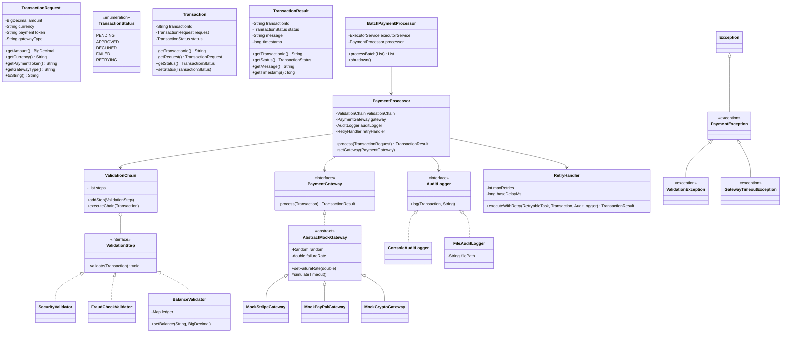

# FinTech Payment Gateway Pipeline - UML Class Diagram

```mermaid
classDiagram
    class TransactionRequest {
        -BigDecimal amount
        -String currency
        -String paymentToken
        -String gatewayType
        +getAmount() BigDecimal
        +getCurrency() String
        +getPaymentToken() String
        +getGatewayType() String
        +toString() String
    }

    class TransactionStatus {
        <<enumeration>>
        PENDING
        APPROVED
        DECLINED
        FAILED
        RETRYING
    }

    class Transaction {
        -String transactionId
        -TransactionRequest request
        -TransactionStatus status
        +getTransactionId() String
        +getRequest() TransactionRequest
        +getStatus() TransactionStatus
        +setStatus(TransactionStatus)
    }

    class TransactionResult {
        -String transactionId
        -TransactionStatus status
        -String message
        -long timestamp
        +getTransactionId() String
        +getStatus() TransactionStatus
        +getMessage() String
        +getTimestamp() long
    }

    class ValidationStep {
        <<interface>>
        +validate(Transaction) void
    }

    class SecurityValidator {
    }
    class FraudCheckValidator {
    }
    class BalanceValidator {
        -Map ledger
        +setBalance(String, BigDecimal)
    }

    ValidationStep <|.. SecurityValidator
    ValidationStep <|.. FraudCheckValidator
    ValidationStep <|.. BalanceValidator

    class ValidationChain {
        -List steps
        +addStep(ValidationStep)
        +executeChain(Transaction)
    }

    ValidationChain o-- ValidationStep

    class PaymentGateway {
        <<interface>>
        +process(Transaction) TransactionResult
    }

    class AbstractMockGateway {
        <<abstract>>
        -Random random
        -double failureRate
        +setFailureRate(double)
        #simulateTimeout()
    }

    class MockStripeGateway {
    }
    class MockPayPalGateway {
    }
    class MockCryptoGateway {
    }

    PaymentGateway <|.. AbstractMockGateway
    AbstractMockGateway <|-- MockStripeGateway
    AbstractMockGateway <|-- MockPayPalGateway
    AbstractMockGateway <|-- MockCryptoGateway

    class AuditLogger {
        <<interface>>
        +log(Transaction, String)
    }

    class ConsoleAuditLogger {
    }
    class FileAuditLogger {
        -String filePath
    }

    AuditLogger <|.. ConsoleAuditLogger
    AuditLogger <|.. FileAuditLogger

    class RetryHandler {
        -int maxRetries
        -long baseDelayMs
        +executeWithRetry(RetryableTask, Transaction, AuditLogger) TransactionResult
    }

    class PaymentProcessor {
        -ValidationChain validationChain
        -PaymentGateway gateway
        -AuditLogger auditLogger
        -RetryHandler retryHandler
        +process(TransactionRequest) TransactionResult
        +setGateway(PaymentGateway)
    }

    PaymentProcessor --> ValidationChain
    PaymentProcessor --> PaymentGateway
    PaymentProcessor --> AuditLogger
    PaymentProcessor --> RetryHandler

    class BatchPaymentProcessor {
        -ExecutorService executorService
        -PaymentProcessor processor
        +processBatch(List) List
        +shutdown()
    }

    BatchPaymentProcessor --> PaymentProcessor

    class PaymentException {
        <<exception>>
    }
    class ValidationException {
        <<exception>>
    }
    class GatewayTimeoutException {
        <<exception>>
    }

    Exception <|-- PaymentException
    PaymentException <|-- ValidationException
    PaymentException <|-- GatewayTimeoutException
```
